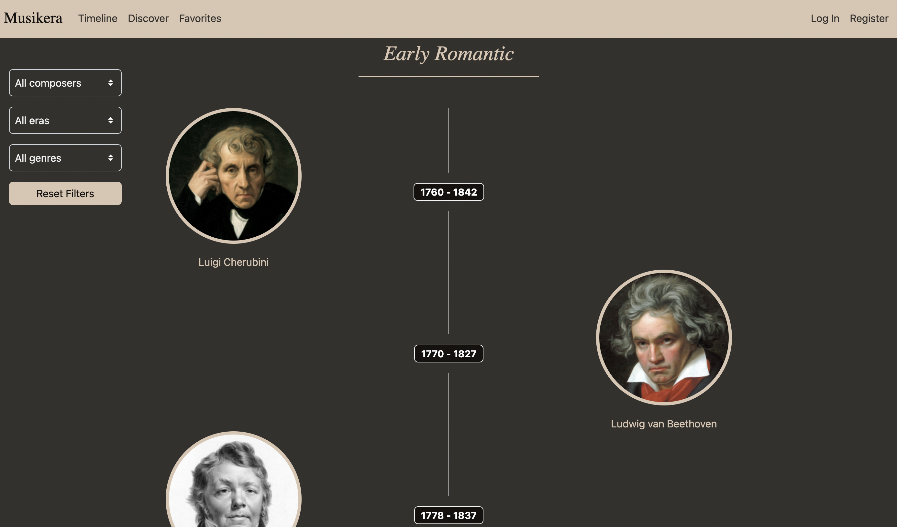
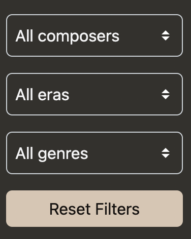
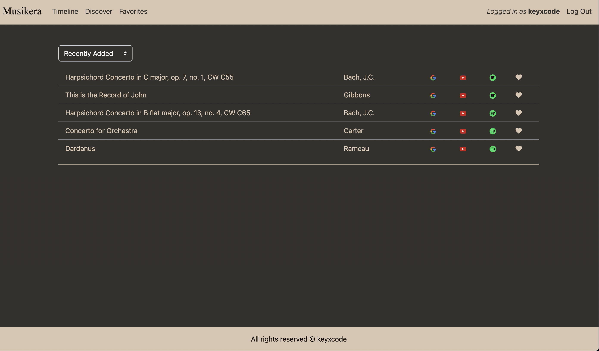

# Musikera
### Video Demo: 

---

### Description

[**Musikera**](https://keyxcode.github.io/hear-harmony/) is a one-stop platform where you can discover over 200 classical composers using an interactive timeline, easily look up their works and save your favorites.

The metadata used in Musikera was provided by the free and open source [*Open Opus API*](https://openopus.org/)

---

### How To Use

*Timeline*

This composer timeline is **Musikera**'s default home page. You can access it by either clicking on the **Musikera** logo or on "Timeline" in the navigation bar. This is where you see all of the composers in the database grouped by their respective musical eras, and ordered chronologically by their birth and death.

Using the filters, you could choose to show only certain composers based on their popularity, their era or the genre of music they composed. Please note that in the popularity filter, "Popular" will show composers who are well-known to the general public, while "Recommended" will show composers who are deemed to be important academically.

Clicking on a composer's image will take you to their page. This presents to you all of their works, categorized into different genres. 

Clicking on a genre toggle will show all of the composer's works in that genre. Next to each work's name, there are also three search buttons, and a like button if the user is logged in. Each search button provides a search result for the respective work on either Google, YouTube or Spotify. 

Similar to the main timeline, this page also features a filter that you could use to narrow down the works based on their popularity. Next to the filter, there's also a "Pick a random work" button. This would simply show you a single random work out of all of the composer's works, which is useful when you are in the mood for discovering something new. 

    Pro-tip

    Clicking on the composer's name leads to the Wikipedia entry of that composer! 

*Discover*

By clicking on "Discover" in the navigation bar, you will be redirected to a random composer's page. You could use this feature to discover composers you never heard of before. 

    Pro-tip

    Combining this feature with "Pick a random work" on the composer's page is the easiest way to discover new works.

*Favorites*

This feature is only available to users who are logged in. It presents you with a list of works that you have liked, ordered in reverse-chronological order by default. This is similar to how most music streaming platforms orders their users' music. Using the filters, you also have the options to present these works in alphabetical order, based on either the work title, or the composer's name.  

---
### Distinctiveness
This project stems from my love for both music and computer technology. Ever since I started discovering the world of classical music and later went on to study it in college, I wished there was a focused, centralized place where I could discover composers of different eras, see all of their works and save those that I like.

I believe Musikera will be a useful tool for any music student or anyone who is interested in music history.

---

### Complexity  
I built Musikera using most of the languages and technologies that CS50W introduced. This includes ***Python (Django framework), HTML, CSS (Bootstrap library), JavaScript, API*** and ***Git***.

Over the course of development, there were countless occasions where I wanted to achieve something that was not covered in the course, and had to do my own research.
One of the earliest obstacles was how to create the timeline tree look for the main page. The solution required some out-of-the-box thinking, where I used two blank divs next to each other with only one border in between visible, which creates the main spine look. The clickable composer images alternate their position from left to right thanks to ***Django***'s *forloop.counter* index, and its *divisibleby* filter. Basically, when it iterates the composer images, those that have an even index will be placed in a normal ***Bootstrap***'s flex-row layout, while the ones that have an odd index will be be placed in a reverse-flex-row, which creates the alternating left-right look. 

Loading all of the metadata into the database posed another problem. I wanted to do it in such a way that the app loads fast, which means not calling the ***API*** for every single request, but is still able to update the itself occasionally when Open Opus updates their databse. My final solution involves using ***Django***'s get_or_create() method, which allows me to load all the data from the API into **Musikera**'s database. If and when there are new composers or works added to the metadata in the future, I will be able to update my database without duplicating old entries. 

Using ***JavaScript***, I managed to not only load and present the data requested to the users, but also change the representation of these data dynamically using filters. These interface updates happen in a single-page application fashion without reloads, which makes for a seamless user experience.  

On the less technical side of things, I am also pleased with how the overall aesthetics of the application turned out to be. By slightly customizing ***Bootstrap***'s default components, I created an original design that has a nice color consistency, offers mobile responsiveness, and in my opinion fits the purpose of the application.

---

### How to run
cd into the project directory

python3 manage.py runserver

---

### File structure
* capstone is the main site directory containing all the required files.
* capstone/composers is the main app directory.
* capstone/composers/urls.py contains all the URLs.
* capstone/composers/models.py contains all the models for the database.
* capstone/composers/views.py contains all the views.
* capstone/composers/template contains all the HTML templates.
* capstone/composers/static contains all the CSS, JS and images.